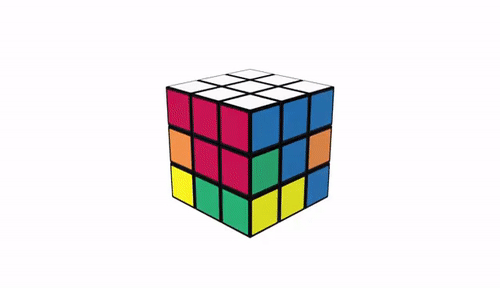

# KonversiSerbaGuna
Projek UAS PBO

Kelompok : 18

Anggota Kelompok (Beserta NiM) :
1. Figo Perdana Putra (192410102022) = https://github.com/figoperdana
2. Akhmad Ardiansyah (192410101142) = https://github.com/AkhmadArdiasnyah

Link : https://github.com/figoperdana/KonversiSerbaGuna/

  Tanpa disadari dalam kehidupan sehari-hari kita tidak bisa terlepas dari yang
namanya pengukuran suatu besaran. Seperti pada saat menghitung waktu yang dibutuhkan
selama perjalanan dari rumah ke kampus, untuk mengukur tinggi badan, dan sebagainya.
Untuk menghitung waktu tersebut digunakan satuan jam yang setelah itu dapat dikonversi
menjadi sekon. Konversi satuan adalah mengubah nilai satuan ke satuan lain yang masih
memiliki besaran yang sama. Besaran dapat digolongkan menjadi besaran pokok dan besaran
turunan. Besaran pokok terdiri dari panjang, massa, waktu, suhu, kuat arus, intensitas cahaya
dan jumlah zat. Sedangkan, besaran turunan contohnya seperti luas, gaya, percepatan, daya,
dan sebagainya.

  Konversi satuan sangat penting dilakukan ketika kita berhubungan dengan hitung-
hitungan nilai besaran. Contohnya ketika hendak mengubah satuan panjang dari meter ke
kilometer (km), mengubah waktu dari jam ke detik, dan lain sebagainya. Jadi, konversi
satuan ini akan berguna tidak hanya di pelajaran sekolah, tapi juga di kehidupan nyata. Oleh
karena, kami berencana untuk membuat KONVERSI SERBA GUNA yaitu sebuah aplikasi
untuk mengkonversi satuan ataupun ruang bidang agar mempermudah pekerjaan atau
kegiatan sehari hari. Kami membuat beberapa fitur-fitur yang nantinya bisa memudahkan
para pengguna mengelola pekerjaan atau kegiatannya seperti login-logout, perhitungan
satuan, perhitungan bangun datar dan juga riwayat.

Fitur : 

a) login-log out
dimana pengguna harus melalui login dan log out agar bisa menggunakan aplikasi
dengan sempurna
b) perhitungan satuan
pada fitur ini pengguna dapat melakukan konversi dari berbagai macam satuan seperti
satuan Panjang, satuan waktu dll.
c) perhitungan bangun datar
fitur perhitungan bangun datar dapat digunakan untuk menghitung luas berbagai
bangun datar seperti persegi Panjang, lingkaran, jajar genjang dll
d) riwayat
didalam fitur Riwayat menyediakan kejadian konversi antara sistem dan pengguna
aplikasi.

